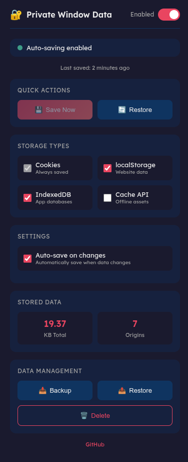

# Save private window data web browser extension

Save cookies, localStorage, IndexedDB, and other website data in private windows and restore them when a new private window is opened.

For preserving website data (settings, to stay logged in to websites, offline app data, etc.) in private windows.

## Features

- **Cookies** - Always saved (core functionality)
- **localStorage** - Website settings and data
- **IndexedDB** - Offline web app databases
- **Cache API** - Offline assets (optional, disabled by default)

## How to use

1. Install the extension and enable it in private windows
2. Open a new private window
3. Configure and/or log in to websites in the private window
4. Use the **Save Now** button or enable **Auto-save on changes** in the extension popup
5. The private window can be closed now, the saved data will be restored automatically when a new private window is opened

## Popup Interface

Click the extension icon to access the popup with:

- **Enable/Disable toggle** - Turn the extension on or off
- **Save Now** - Manually save all data from current private windows
- **Restore** - Manually restore data to current private windows
- **Storage type toggles** - Choose which types of data to save:
  - Cookies (always on)
  - localStorage
  - IndexedDB
  - Cache API (optional)
- **Auto-save on changes** - Automatically save when data changes
- **Backup/Restore** - Export and import saved data as JSON
- **Delete** - Clear all stored data

### Data Reconciliation

When enabling the extension while a private window is already open, you'll be asked how to handle the existing data:
- **Save current data first** - Save what's in the private window before enabling
- **Restore saved data** - Overwrite current private window data with saved data
- **Skip** - Enable without changing any data

## Privacy Note

This extension is designed to preserve data across private browsing sessions. This data is stored locally on your device. No data is collected or transmitted.

⚠️ **Warning**: This extension defeats some privacy protections of private browsing by persisting data that would normally be cleared. Only use if you understand and accept this trade-off.

## Permissions

- **Access data for all websites**: to save and restore cookies and web storage in private windows for all websites
- **Download files and read and modify the browser's download history**: to backup the saved data
- **Clear recent browsing history, cookies, and related data** (Mozilla Firefox only): used to clear all cookies in open private windows when using the Delete button and on Restore

## Screenshot

\
Popup Interface

## Development

This repository contains two manifest files for different browsers:

| File | Browser | Notes |
|------|---------|-------|
| `manifest.json` | Chrome/Edge | Uses `service_worker` for background |
| `manifest-firefox.json` | Firefox | Uses `scripts` array for background |

### Install / Loading Unpacked Extension

**Chrome / Edge:**
1. Go to `chrome://extensions` (or `edge://extensions`)
2. Enable **Developer mode** (toggle in top right)
3. Click **Load unpacked**
4. Select the extension folder (containing `manifest.json`)
5. Go to extension details → enable **Allow in Incognito** / **Allow in InPrivate**

**Firefox:**
1. Rename `manifest-firefox.json` to `manifest.json`
2. Go to `about:debugging#/runtime/this-firefox`
3. Click **Load Temporary Add-on**
4. Select `manifest.json` from the extension folder
5. Go to `about:addons` → extension settings → enable **Run in Private Windows**

<!-- ## Install

- [Mozilla Firefox](https://addons.mozilla.org/en-US/firefox/addon/save-private-window-cookies/)
- [Google Chrome](https://chrome.google.com/webstore/detail/save-private-window-cooki/ojefealibpfjmbmljkdnhgobfllfempa)
- [Microsoft Edge](https://microsoftedge.microsoft.com/addons/detail/save-private-window-cooki/okhnojkilenjjeoeejhkodmdfhojicei) -->

## Backup File Format

The backup file is a JSON file with the following structure:

```json
{
  "version": 2,
  "timestamp": "2024-01-01T00:00:00.000Z",
  "cookies": [...],
  "webStorage": {
    "https://example.com": {
      "localStorage": { "key": "value" },
      "indexedDB": [...],
      "cacheStorage": [...]
    }
  }
}
```

Version 1 backup files (cookies only) are still supported for import.

## Credits

- Original from [Adam777Z](https://github.com/Adam777Z/save-private-window-cookies-web-browser-extension)
- Icon from [Bootstrap Icons](https://icons.getbootstrap.com/) v1.5.0 ([box-arrow-in-down](https://icons.getbootstrap.com/icons/box-arrow-in-down/))
